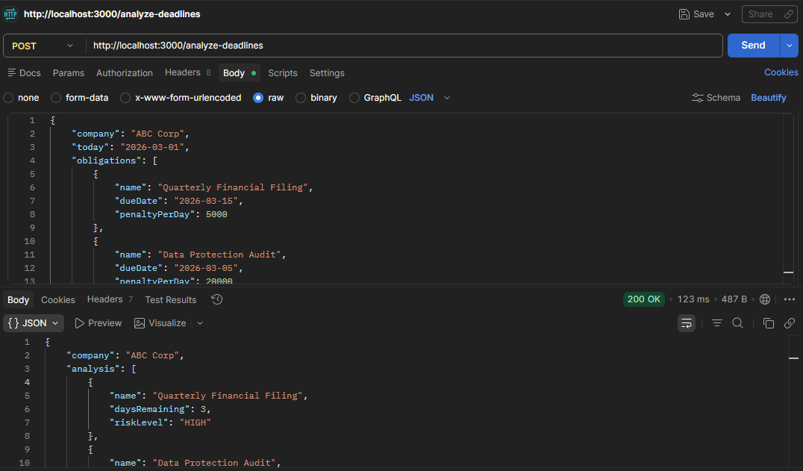

# Regulatory Compliance Deadline Tracker API

A lightweight API that analyzes regulatory compliance deadlines and identifies risk levels before penalties occur.

---

# Industry

Finance / Fintech / Healthcare / Insurance

These industries operate under strict regulatory requirements and must constantly submit filings, audits, and compliance reports.

---

# The Problem

Companies in regulated industries often lose money due to:

- Missed regulatory filings
- Late compliance submissions
- Expired licenses
- Poor deadline visibility

Many compliance teams still track obligations manually using:

- spreadsheets
- calendar reminders
- email alerts

Manual tracking increases the risk of human error and missed deadlines.

Even a single missed filing can result in **thousands of dollars in penalties per day**.

---

# What This API Does

The **Regulatory Compliance Deadline Tracker API** helps analyze regulatory obligations automatically.

The API:

- Accepts compliance obligations
- Calculates the number of days remaining until each deadline
- Categorizes the risk level
- Flags urgent obligations
- Estimates potential penalty exposure

The API is designed to be **lightweight** and **stateless**.

No database is required.  
All data is provided in the request payload.

---

# API Endpoint

## POST `/analyze-deadlines`

Analyzes compliance obligations and returns risk levels based on how close the deadlines are.

---

# Example Request

```json
{
  "company": "ABC Corp",
  "today": "2026-03-01",
  "obligations": [
    {
      "name": "Quarterly Financial Filing",
      "dueDate": "2026-03-15",
      "penaltyPerDay": 5000
    },
    {
      "name": "Data Protection Audit",
      "dueDate": "2026-03-05",
      "penaltyPerDay": 20000
    }
  ]
}
```

---

# Example Response (As of 12/03/2026)

```json
{
    "company": "ABC Corp",
    "analysis": [
        {
            "name": "Quarterly Financial Filing",
            "daysRemaining": 3,
            "riskLevel": "HIGH"
        },
        {
            "name": "Data Protection Audit",
            "daysRemaining": -7,
            "riskLevel": "CRITICAL",
            "penaltyExposure": 140000
        }
    ],
    "totalPenaltyExposureIfLateToday": 140000
}
```

---

# Risk Classification Logic

The API classifies compliance risk using the following rules:

| Days Remaining | Risk Level |
|----------------|-----------|
| < 0 days | CRITICAL |
| 1 – 9 days | HIGH |
| 10 – 30 days | MEDIUM |
| > 30 days | LOW |

This allows compliance teams to quickly identify urgent obligations.

---

# Tech Stack

- Node.js
- Express.js
- JSON API design

---

# Concepts Practiced

This project focuses on backend development fundamentals including:

- Date parsing
- Mathematical calculations
- Conditional logic
- Data transformation
- Structured JSON responses
- API error handling

---

# Example Use Cases

This API could be integrated into systems such as:

### Compliance Dashboards
Internal dashboards that monitor regulatory deadlines.

### Fintech Risk Monitoring Tools
Automatically identify upcoming regulatory risks.

### Compliance Automation Platforms
Trigger alerts when deadlines approach.

### Regulatory Alert Systems
Notify compliance teams when filings become urgent.

---

# Testing the API

You can test the endpoint using tools such as:

- Postman
- Insomnia
- curl
- frontend applications

---

# Postman Example

Below is an example request being executed in Postman.



---

# Why This Project Exists

Most API tutorials demonstrate basic examples like **todo list APIs**.

This project focuses on solving a **real operational problem** faced by regulated industries.

Small automation tools like this can help companies:

- reduce compliance risk
- improve deadline visibility
- avoid financial penalties

---

# License

MIT License

---

# Author

Built by a [ELLA](https://github.com/git-ellea). If you found this project interesting, feel free to ⭐ the repository.